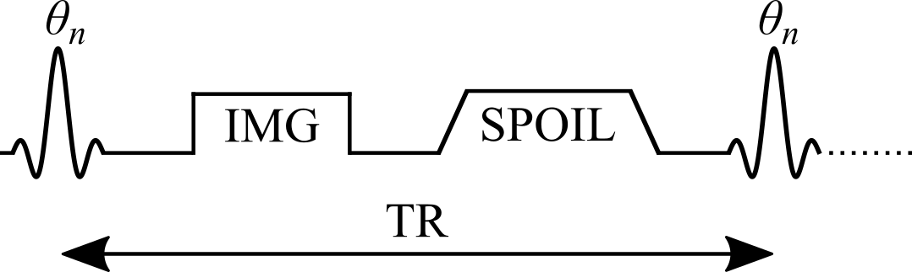

---
redirect_from:
  - "/01/vfa-blog/vfa-introduction"
interact_link: content/01/vfa_blog/VFA_Introduction.ipynb
kernel_name: sos
title: 'Variable Flip Angle'
prev_page:
  url: /01/ir_blog/IR_References
  title: 'References'
next_page:
  url: /01/vfa_blog/VFA_SignalModelling
  title: 'Signal Modelling'
comment: "***PROGRAMMATICALLY GENERATED, DO NOT EDIT. SEE ORIGINAL FILES IN /content***"
---

## Variable Flip Angle T1 Mapping

Variable flip angle (VFA) T1 mapping (Christensen et al. 1974; Gupta 1977; Fram et al. 1987), also known as Driven Equilibrium Single Pulse Observation of T1 (DESPOT1) (Homer & Beevers 1985; Deoni et al. 2003), is a rapid quantitative T1 measurement technique that is widely used to acquire 3D T1 maps (e.g. whole-brain) in a clinically feasible time. VFA estimates T1 values by acquiring multiple spoiled gradient echo acquisitions, each with different excitation flip angles (<i>θn</i> for n = 1, 2, .., N and <i>θi</i> ≠ <i>θj</i>). The steady-state signal of this pulse sequence (Figure 1) uses very short TRs (on the order of magnitude of 10 ms) and is very sensitive to T1 for a wide range of flip angles.

VFA is a technique that originates from the NMR field, and was adopted because of its time efficiency and the ability to acquire accurate T1 values simultaneously for a wide range of values (Christensen et al. 1974; Gupta 1977). For imaging applications, VFA also benefits from an increase in SNR because it can be acquired using a 3D acquisition instead of multislice, which also helps to reduce slice profile effects. One important drawback of VFA for T1 mapping is that the signal is very sensitive to inaccuracies in the flip angle value, thus impacting the T1 estimates.  In practice, the nominal flip angle (i.e. the value set at the scanner) is different than the actual flip angle experienced by the spins (e.g. at 3.0 T, variations of up to ±30%), an issue that increases with field strength. VFA typically requires the acquisition of another quantitative map, the transmit RF amplitude (B1+, or B1 for short), to calibrate the nominal flip angle to its actual value because of B1 inhomogeneities that occur in most loaded MRI coils (Sled & Pike 1998). The need to acquire an additional B1 map reduces the time savings offered by VFA over saturation-recovery techniques, and inaccuracies/imprecisions of the B1 map are also propagated into the VFA T1 map (Boudreau et al. 2017; Lee et al. 2017).

<b>
Figure 1. Simplified pulse sequence diagram of a variable flip angle (VFA) pulse sequence with a gradient echo readout. TR: repetition time, <i>θn</i>: excitation flip angle for the nth measurement, IMG: image acquisition (k-space readout), SPOIL: spoiler gradient.
</b>

